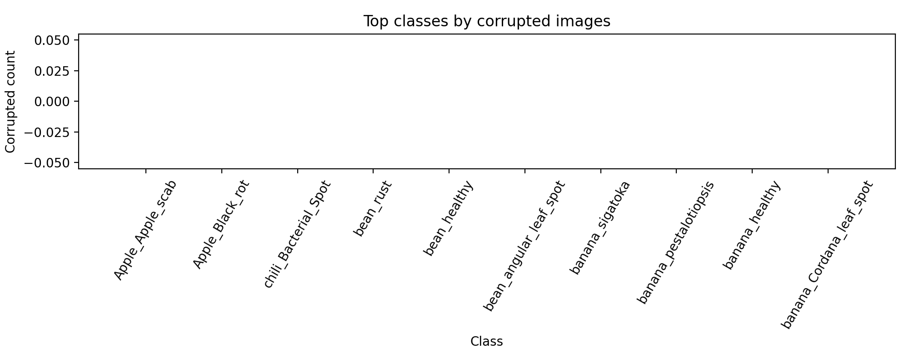
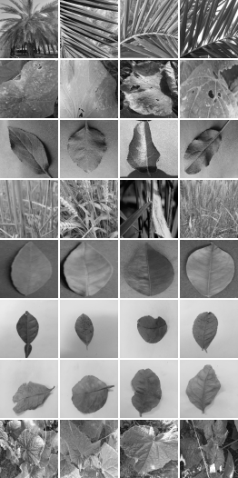

# plant diseases EDA Report


## Classes

Found **96** classes. Saved list to `classes.txt`.

**Class Counts** — saved CSV: `class_counts.csv`

**Preview (96 rows)**:

```
class,count
Apple_Apple_scab,2520
Apple_Black_rot,2484
Apple_Cedar_apple_rust,2200
Apple_healthy,2510
Blueberry_healthy,1816
Cherry_Powdery_mildew,1683
Cherry_healthy,1826
Corn_Cercospora_leaf_spot Gray_leaf_spot,1642
Corn_Common_rust_,1907
Corn_Northern_Leaf_Blight,1908
Corn_healthy,1859
Cucumber ـBacterialـWilt,160
Cucumber_Gummy_Stem_Blight,160
Cucumber_Pythium_Fruit_Rot,169
CucumberـAnthracnose,160
CucumberـBelly Rot,160
CucumberـDownyـMildew,160
Cucumberـhealthy,160
Downy_mildew_on_lettuce,30
Grape_Black_rot,1888
Grape_Esca_(Black_Measles),1920
Grape___Leaf_blight_(Isariopsis_Leaf_Spot),1722
Grape_healthy,1692
Lemon_Anthracnose,251
Lemon_Black_Spot,88
Lemon_Citrus_Canker,33
Lemon_Citrus_Leaf_Miner,89
Lemon_Curl_Leaf,79
Lemon_Dry_leaf,97
Lemon_Greening,438
Lemon_Healthy,221
Lemon_Melanose,126
Lettuce_Bacterial,20
LettuceـHealthy,1123
LettuceـShepherd_purse_weeds,1106
Orange_Haunglongbing_(Citrus_greening),2010
Peach_Bacterial_spot,1838
Peach_healthy,1728
Pepper_bell_Bacterial_spot,2088
Pepper_bell_healthy,2300
Potato_Early_blight,2149
Potato_Late_blight,2131
Potato_healthy,1854
Powdery_mildew_on_lettuce,18
Septoria_blight_on_lettuce,19
Soybean___healthy,2022
Squash_Powdery_mildew,1736
Strawberry_Leaf_scorch,1774
Strawberry_healthy,1824
Tomato_Bacterial_spot,2127
Tomato_Early_blight,1000
Tomato_Late_blight,1909
Tomato_Leaf_Mold,952
Tomato_Septoria_leaf_spot,1771
Tomato_Spider_mites_Two_spotted_spider_mite,1676
Tomato_Target_Spot,1404
Tomato_Yellow_Leaf_Curl_Virus,3208
Tomato_healthy,1591
Tomato_mosaic_virus,373
Watermelon_Downy_Mildew,380
Watermelon_Healthy,205
Watermelon_Mosaic_Virus,415
Wilt_and_leaf_blight_on_lettuce,6
banana_Cordana_leaf_spot,162
banana_healthy,129
banana_pestalotiopsis,173
banana_sigatoka,473
bean_angular_leaf_spot,330
bean_healthy,330
bean_rust,330
chili_Bacterial_Spot,156
chili_Cercospora_Leaf_Spot,180
chili_Curl_Virus,423
chili_Healthy,458
chili_Nutrition_Deficiency,444
chili_White_spot,195
olive_Healthy,950
olive_aculus_olearius,890
olive_peacock_spot,1460
plam_Black_Scorch,49
plam_Fusarium_Wilt,62
plam_Healthy,27
plam_Leaf_Spots,28
plam_Magnesium_Deficiency,22
plam_Manganese_Deficiency,0
plam_Parlatoria_Blanchardi,21
plam_Potassium_Deficiency,58
plam_Rachis_Blight,69
plam_infected_by_Bug,600
plam_infected_by_Dubas,800
rice_Bacterial_leaf_blight,40
rice_Brown_spot,40
rice_Leaf_smut,40
wheat_leaf_brown_rust,12
wheat_stem_black_rust,12
wheat_strip_yellowrust,12

```

**Class Distribution (bar)**


**Class Counts with Percentage** — saved CSV: `class_counts_with_percentage.csv`

**Preview (96 rows)**:

```
class,count,percentage
Tomato_Yellow_Leaf_Curl_Virus,3208,3.8240553105256883
Apple_Apple_scab,2520,3.003933722732149
Apple_healthy,2510,2.9920133508165456
Apple_Black_rot,2484,2.961020383835976
Pepper_bell_healthy,2300,2.7416855405888665
Apple_Cedar_apple_rust,2200,2.622481821432829
Potato_Early_blight,2149,2.5616879246632496
Potato_Late_blight,2131,2.5402312552151627
Tomato_Bacterial_spot,2127,2.5354631064489213
Pepper_bell_Bacterial_spot,2088,2.4889736559780666
Soybean___healthy,2022,2.4102992013350817
Orange_Haunglongbing_(Citrus_greening),2010,2.3959947550363574
Grape_Esca_(Black_Measles),1920,2.2887114077959234
Tomato_Late_blight,1909,2.275598998688759
Corn_Northern_Leaf_Blight,1908,2.2744069614971987
Corn_Common_rust_,1907,2.2732149243056385
Grape_Black_rot,1888,2.250566217665991
Corn_healthy,1859,2.2159971391107405
Potato_healthy,1854,2.2100369531529385
Peach_Bacterial_spot,1838,2.1909643580879723
Cherry_healthy,1826,2.176659911789248
Strawberry_healthy,1824,2.174275837406127
Blueberry_healthy,1816,2.164739539873644
Strawberry_Leaf_scorch,1774,2.1146739778281085
Tomato_Septoria_leaf_spot,1771,2.1110978662534268
Squash_Powdery_mildew,1736,2.069376564548814
Peach_healthy,1728,2.0598402670163307
Grape___Leaf_blight_(Isariopsis_Leaf_Spot),1722,2.052688043866969
Grape_healthy,1692,2.0169269281201574
Cherry_Powdery_mildew,1683,2.006198593396114
Tomato_Spider_mites_Two_spotted_spider_mite,1676,1.9978543330551914
Corn_Cercospora_leaf_spot Gray_leaf_spot,1642,1.9573250685421386
Tomato_healthy,1591,1.8965311717725593
olive_peacock_spot,1460,1.7403742996781502
Tomato_Target_Spot,1404,1.6736202169507688
LettuceـHealthy,1123,1.338657766122303
LettuceـShepherd_purse_weeds,1106,1.3183931338657766
Tomato_Early_blight,1000,1.1920371915603767
Tomato_Leaf_Mold,952,1.1348194063654786
olive_Healthy,950,1.1324353319823577
olive_aculus_olearius,890,1.060913100488735
plam_infected_by_Dubas,800,0.9536297532483013
plam_infected_by_Bug,600,0.715222314936226
banana_sigatoka,473,0.5638335916080581
chili_Healthy,458,0.5459530337346525
chili_Nutrition_Deficiency,444,0.5292645130528072
Lemon_Greening,438,0.522112289903445
chili_Curl_Virus,423,0.5042317320300393
Watermelon_Mosaic_Virus,415,0.49469543449755626
Watermelon_Downy_Mildew,380,0.45297413279294313
Tomato_mosaic_virus,373,0.44462987245202046
bean_rust,330,0.3933722732149243
bean_healthy,330,0.3933722732149243
bean_angular_leaf_spot,330,0.3933722732149243
Lemon_Anthracnose,251,0.29920133508165453
Lemon_Healthy,221,0.26344021933484324
Watermelon_Healthy,205,0.2443676242698772
chili_White_spot,195,0.23244725235427344
chili_Cercospora_Leaf_Spot,180,0.2145666944808678
banana_pestalotiopsis,173,0.20622243413994518
Cucumber_Pythium_Fruit_Rot,169,0.20145428537370366
banana_Cordana_leaf_spot,162,0.19311002503278102
CucumberـDownyـMildew,160,0.19072595064966025
CucumberـBelly Rot,160,0.19072595064966025
CucumberـAnthracnose,160,0.19072595064966025
Cucumberـhealthy,160,0.19072595064966025
Cucumber_Gummy_Stem_Blight,160,0.19072595064966025
Cucumber ـBacterialـWilt,160,0.19072595064966025
chili_Bacterial_Spot,156,0.18595780188341876
banana_healthy,129,0.15377279771128857
Lemon_Melanose,126,0.15019668613660747
Lemon_Dry_leaf,97,0.11562760758135654
Lemon_Citrus_Leaf_Miner,89,0.10609131004887352
Lemon_Black_Spot,88,0.10489927285731314
Lemon_Curl_Leaf,79,0.09417093813326977
plam_Rachis_Blight,69,0.082250566217666
plam_Fusarium_Wilt,62,0.07390630587674335
plam_Potassium_Deficiency,58,0.06913815711050185
plam_Black_Scorch,49,0.058409822386458456
rice_Leaf_smut,40,0.04768148766241506
rice_Brown_spot,40,0.04768148766241506
rice_Bacterial_leaf_blight,40,0.04768148766241506
Lemon_Citrus_Canker,33,0.03933722732149243
Downy_mildew_on_lettuce,30,0.0357611157468113
plam_Leaf_Spots,28,0.033377041363690546
plam_Healthy,27,0.03218500417213017
plam_Magnesium_Deficiency,22,0.026224818214328285
plam_Parlatoria_Blanchardi,21,0.025032781022767913
Lettuce_Bacterial,20,0.02384074383120753
Septoria_blight_on_lettuce,19,0.022648706639647156
Powdery_mildew_on_lettuce,18,0.02145666944808678
wheat_leaf_brown_rust,12,0.01430444629872452
wheat_stem_black_rust,12,0.01430444629872452
wheat_strip_yellowrust,12,0.01430444629872452
Wilt_and_leaf_blight_on_lettuce,6,0.00715222314936226
plam_Manganese_Deficiency,0,0.0

```

**Class Balance (pie)**


**Corrupted Images per Class** — saved CSV: `corrupted_counts_per_class.csv`

**Preview (96 rows)**:

```
class,corrupted
Apple_Apple_scab,0
Apple_Black_rot,0
chili_Bacterial_Spot,0
bean_rust,0
bean_healthy,0
bean_angular_leaf_spot,0
banana_sigatoka,0
banana_pestalotiopsis,0
banana_healthy,0
banana_Cordana_leaf_spot,0
Wilt_and_leaf_blight_on_lettuce,0
Watermelon_Mosaic_Virus,0
Watermelon_Healthy,0
Watermelon_Downy_Mildew,0
Tomato_mosaic_virus,0
Tomato_healthy,0
Tomato_Yellow_Leaf_Curl_Virus,0
Tomato_Target_Spot,0
Tomato_Spider_mites_Two_spotted_spider_mite,0
Tomato_Septoria_leaf_spot,0
Tomato_Leaf_Mold,0
Tomato_Late_blight,0
Tomato_Early_blight,0
chili_Cercospora_Leaf_Spot,0
chili_Curl_Virus,0
chili_Healthy,0
plam_Parlatoria_Blanchardi,0
wheat_stem_black_rust,0
wheat_leaf_brown_rust,0
rice_Leaf_smut,0
rice_Brown_spot,0
rice_Bacterial_leaf_blight,0
plam_infected_by_Dubas,0
plam_infected_by_Bug,0
plam_Rachis_Blight,0
plam_Potassium_Deficiency,0
plam_Manganese_Deficiency,0
chili_Nutrition_Deficiency,0
plam_Magnesium_Deficiency,0
plam_Leaf_Spots,0
plam_Healthy,0
plam_Fusarium_Wilt,0
plam_Black_Scorch,0
olive_peacock_spot,0
olive_aculus_olearius,0
olive_Healthy,0
chili_White_spot,0
Tomato_Bacterial_spot,0
Strawberry_healthy,0
Strawberry_Leaf_scorch,0
Cucumber_Gummy_Stem_Blight,0
Grape___Leaf_blight_(Isariopsis_Leaf_Spot),0
Grape_Esca_(Black_Measles),0
Grape_Black_rot,0
Downy_mildew_on_lettuce,0
Cucumberـhealthy,0
CucumberـDownyـMildew,0
CucumberـBelly Rot,0
CucumberـAnthracnose,0
Cucumber_Pythium_Fruit_Rot,0
Cucumber ـBacterialـWilt,0
Lemon_Anthracnose,0
Corn_healthy,0
Corn_Northern_Leaf_Blight,0
Corn_Common_rust_,0
Corn_Cercospora_leaf_spot Gray_leaf_spot,0
Cherry_healthy,0
Cherry_Powdery_mildew,0
Blueberry_healthy,0
Apple_healthy,0
Apple_Cedar_apple_rust,0
Grape_healthy,0
Lemon_Black_Spot,0
Squash_Powdery_mildew,0
Peach_Bacterial_spot,0
Soybean___healthy,0
Septoria_blight_on_lettuce,0
Powdery_mildew_on_lettuce,0
Potato_healthy,0
Potato_Late_blight,0
Potato_Early_blight,0
Pepper_bell_healthy,0
Pepper_bell_Bacterial_spot,0
Peach_healthy,0
Orange_Haunglongbing_(Citrus_greening),0
Lemon_Citrus_Canker,0
LettuceـShepherd_purse_weeds,0
LettuceـHealthy,0
Lettuce_Bacterial,0
Lemon_Melanose,0
Lemon_Healthy,0
Lemon_Greening,0
Lemon_Dry_leaf,0
Lemon_Curl_Leaf,0
Lemon_Citrus_Leaf_Miner,0
wheat_strip_yellowrust,0

```


## Corrupted Summary

Total corrupted files: **0**

**Top classes by corrupted images**



**Sample Grid**




## Duplicates Summary

Total duplicate files (scanned): **222** (see `duplicates_by_class.json`)

**Duplicates per Class** — saved CSV: `duplicates_per_class.csv`

**Preview (16 rows)**:

```
class,duplicates
olive_Healthy,59
plam_infected_by_Bug,59
banana_healthy,38
olive_aculus_olearius,14
Apple_healthy,10
Cucumber_Pythium_Fruit_Rot,9
Tomato_Late_blight,8
Tomato_healthy,6
LettuceـShepherd_purse_weeds,4
chili_Bacterial_Spot,4
Lettuce_Bacterial,3
plam_infected_by_Dubas,3
olive_peacock_spot,2
Cucumber ـBacterialـWilt,1
Septoria_blight_on_lettuce,1
plam_Rachis_Blight,1

```


## Final Summary

- Classes: **96**
- Total images: **83890**
- Corrupted files: **0**
- Duplicates (scanned): **222**
- Outputs folder: `EDA_outputs`
- Report file: `eda_report.md`

