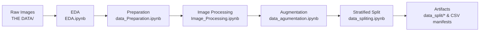
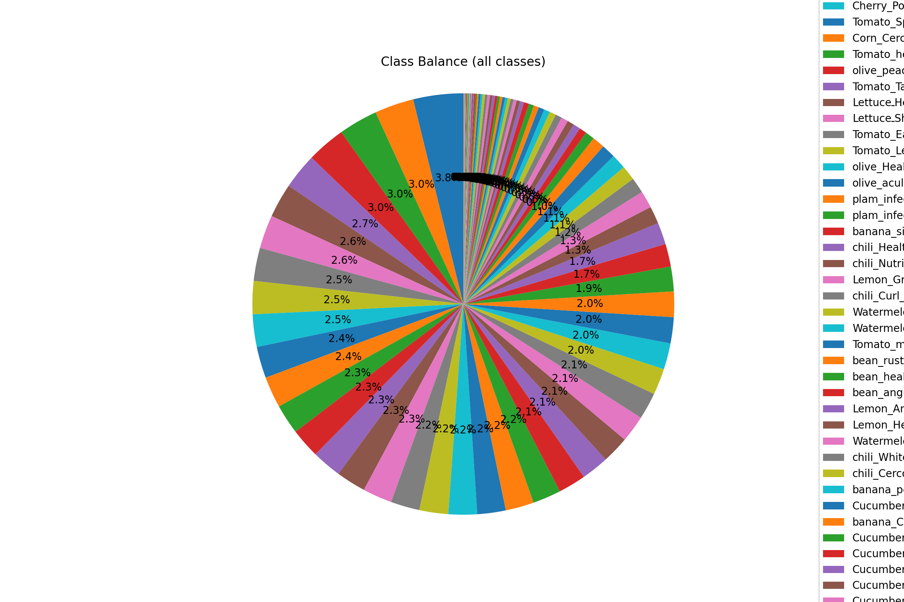
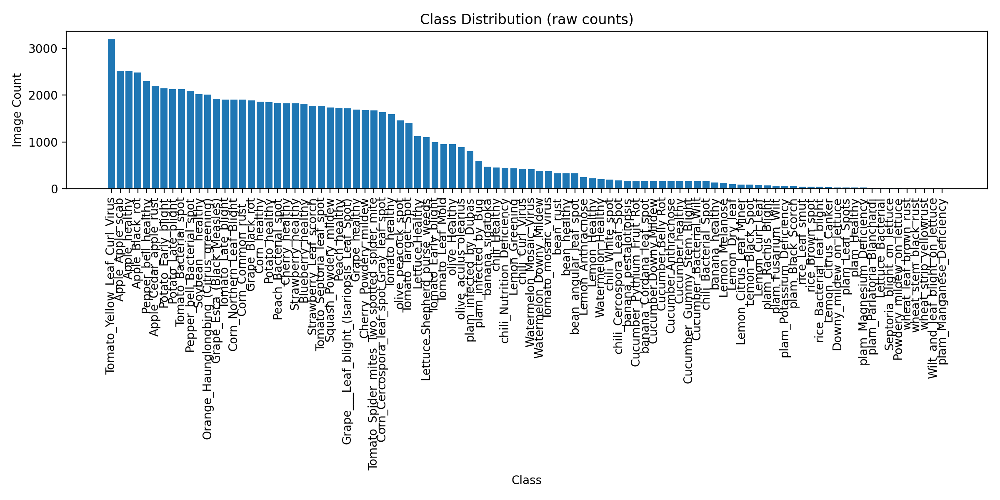

<div align="center">


# Ghiras Data Preparation · Plant Disease Dataset Pipeline

[](https://github.com/aldajani0/Ghiras_data_prep-/blob/main/EDA.ipynb)
[](#requirements)
[](#quick-start)
[](#)
[](#reproducibility)
[](#license)

*A clean, reproducible pipeline for preparing plant‑disease image datasets — EDA → preparation → processing → augmentation → stratified splitting.*

</div>

---

## ✨ Highlights
- **Readable & interactive** README with collapsible sections, diagram, and a visual gallery.
- **Deterministic runs** with seeds and CSV manifests for experiment traceability.
- **Safe-by-default**: raw data stays untouched; all writes go to working dirs.
- **Colab-friendly**: plug in your `DATA_PATH` and go.

---

## 🔗 Quick Links
- **Open notebooks in Colab** →  
  EDA [](https://github.com/aldajani0/Ghiras_data_prep-/blob/main/EDA.ipynb) ·
  Preparation [](https://github.com/aldajani0/Ghiras_data_prep-/blob/main/data_Preparation.ipynb) ·
  Image Processing [](https://github.com/aldajani0/Ghiras_data_prep-/blob/main/Image_Processing.ipynb) ·
  Augmentation [](https://github.com/aldajani0/Ghiras_data_prep-/blob/main/data_agumentation.ipynb) ·
  Splitting [](https://github.com/aldajani0/Ghiras_data_prep-/blob/main/data_spliting.ipynb)

- **Key folders** → [`EDA_outputs/`](./EDA_outputs) · [`plant_disease_project/logs/`](./plant_disease_project/logs) · [`plant_disease_project2/`](./plant_disease_project2)

---

## 🧭 Table of Contents
- [Overview](#overview)
- [Repository Structure](#repository-structure)
- [Quick Start](#quick-start)
- [Recommended Run Order](#recommended-run-order)
- [Gallery](#gallery)
- [Outputs & Artifacts](#outputs--artifacts)
- [Reproducibility](#reproducibility)
- [FAQ](#faq)
- [Roadmap](#roadmap)
- [License](#license)

---

## 🌱 Overview
This repo hosts the **Ghiras** data-prep pipeline for plant-health vision tasks. It emphasizes **good ML hygiene**: deterministic seeds, provenance logs, and visual checks for every step.

> 💡 **Tip:** Keep your raw dataset **read-only**. The pipeline writes copies and artifacts to `plant_disease_project2/` so you can always reproduce from the original source.

---

## 🗂️ Repository Structure
```
EDA_outputs/
  class_balance.png
  class_counts_with_percentage.csv
  class_counts.csv
  class_distribution.png
  classes.txt
  corrupted_counts_per_class.csv
  corrupted_top10.png
  duplicates_by_class.json
  duplicates_per_class.csv
  eda_report.md
  sample_grid.png

plant_disease_project/
  logs/
    02_duplicates_summary.csv
    02_duplicates_to_remove.json
    03_cleaning_summary.json

plant_disease_project2/
  data_split/
  logs/
    05_processing_summary_inplace.json
    processing_log.csv
  processing_techniques/
    disease_distribution_after.png
    processing_pipeline_inplace.png

THE DATA/

data_agumentation.ipynb
data_Preparation.ipynb
data_spliting.ipynb
EDA.ipynb
Image_Processing.ipynb
```
> **Note:** Notebook filenames intentionally match current working names.

---

## ⚡ Quick Start
<details>
  <summary><b>1) Clone & (optional) virtual env</b></summary>

```bash
git clone https://github.com/aldajani0/Ghiras_data_prep-.git
cd Ghiras_data_prep-

python -m venv .venv
# macOS/Linux:
source .venv/bin/activate
# Windows:
# .venv\Scripts\activate

pip install numpy pandas matplotlib pillow opencv-python scikit-learn tqdm ipywidgets
# optional:
pip install tensorflow
```
</details>

<details>
  <summary><b>2) Point <code>DATA_PATH</code> to your raw dataset</b></summary>

```python
DATA_PATH = "/path/to/THE DATA"  # e.g., "/content/drive/MyDrive/GHIRAS'S DATAST/THE DATA"
SEED = 42
```
</details>

<details>
  <summary><b>3) Run notebooks in order</b></summary>
Use the Colab badges above or Jupyter locally.
</details>

---

## ▶️ Recommended Run Order
1. **EDA.ipynb** — explore classes, counts, sizes; duplicates/corrupts; write charts to `EDA_outputs/`.  
   [](https://github.com/aldajani0/Ghiras_data_prep-/blob/main/EDA.ipynb)

2. **data_Preparation.ipynb** — validate paths & structure; build manifests; log to `plant_disease_project/logs/`.  
   [](https://github.com/aldajani0/Ghiras_data_prep-/blob/main/data_Preparation.ipynb)

3. **Image_Processing.ipynb** — resize, denoise, contrast, normalize; log summaries to `plant_disease_project2/logs/`.  
   [](https://github.com/aldajani0/Ghiras_data_prep-/blob/main/Image_Processing.ipynb)

4. **data_agumentation.ipynb** — training-only transforms with previews.  
   [](https://github.com/aldajani0/Ghiras_data_prep-/blob/main/data_agumentation.ipynb)

5. **data_spliting.ipynb** — create **stratified** Train/Val/Test splits and CSV manifests in `plant_disease_project2/data_split/`.  
   [](https://github.com/aldajani0/Ghiras_data_prep-/blob/main/data_spliting.ipynb)

<details>
  <summary><b>Pipeline (Mermaid)</b></summary>


</details>

---

## 🖼️ Gallery
<p align="center">
  &nbsp;&nbsp;
  <br><br>
</p>

> 🔎 See also: [`EDA_outputs/eda_report.md`](./EDA_outputs/eda_report.md)

---

## 📦 Outputs & Artifacts
- `EDA_outputs/` → class balances/distributions, duplicate/corrupt reports, sample grids, **`eda_report.md`**.
- `plant_disease_project/logs/` → CSV/JSON logs of duplicates & cleaning decisions.
- `plant_disease_project2/logs/` → **`05_processing_summary_inplace.json`**, **`processing_log.csv`**.
- `processing_techniques/` → pipeline diagram & post‑processing distribution figures.
- `data_split/` → stratified **Train/Val/Test** folders + `*_split.csv` manifests.

---

## ♻️ Reproducibility
- Fix **`SEED`** (e.g., `42`) for any randomness.
- Keep raw data **read‑only**; write to working dirs only.
- Apply augmentation **only to training**.
- Commit manifests and logs to version control for provenance.

> ✅ Checklist
> - [x] Deterministic seeds  
> - [x] Logs & manifests committed  
> - [x] Augment only train  
> - [x] Raw data untouched


---

## 🗺️ Roadmap
- [ ] Optional `requirements.txt` and `Makefile`
- [ ] CLI wrapper for non‑notebook runs
- [ ] Automated EDA summary export to HTML/PDF
- [ ] Class imbalance utilities (weighted sampling)

---

<p align="center">
Made with ❤️ for <b>Ghiras</b> · <i>Last updated:</i> 2025-10-30
</p>
